# クリーンアーキテクチャに基づくクラス設計

## 現状分析

現在のプロジェクトは**MVP（Model-View-Presenter）パターン**を採用していますが、クリーンアーキテクチャの観点から見ると、以下の改善点があります：

### 現状の問題点
1. **Presenterがビジネスロジックと表示ロジックを両方持っている**
   - 本来Presenterは「表示のための変換」のみを担当すべき
2. **UseCaseレイヤー（Interactor）が存在しない**
   - ビジネスロジックがPresenterやStateに散在している
3. **Controllerレイヤーが存在しない**
   - Viewが直接Presenterを呼び出している

---

## 提案：クリーンアーキテクチャへのリファクタリング

### アーキテクチャ構成

```
┌─────────────────────────────────────────────────────────────┐
│                    FrameworkAndDriver層                      │
│  ┌──────────┐  ┌──────────┐  ┌──────────┐                  │
│  │TitleView │  │HomeView  │  │Settings  │  MonoBehaviour   │
│  │          │  │          │  │View      │                  │
│  └──────────┘  └──────────┘  └──────────┘                  │
└─────────────────────────────────────────────────────────────┘
                        ↑
┌─────────────────────────────────────────────────────────────┐
│                  InterfaceAdapter層                          │
│  ┌────────────────┐         ┌──────────────────┐           │
│  │  Controller    │         │   Presenter      │           │
│  ├────────────────┤         ├──────────────────┤           │
│  │TitleController │         │TitlePresenter    │           │
│  │HomeController  │         │HomePresenter     │           │
│  │Settings        │         │Settings          │           │
│  │Controller      │         │Presenter         │           │
│  └────────────────┘         └──────────────────┘           │
└─────────────────────────────────────────────────────────────┘
         ↓                              ↑
┌─────────────────────────────────────────────────────────────┐
│                     UseCase層                                │
│  ┌──────────────────────────────────────────────────────┐  │
│  │                   Interactor                         │  │
│  ├──────────────────────────────────────────────────────┤  │
│  │ NavigateToHomeInteractor                            │  │
│  │ OpenSettingsInteractor                              │  │
│  │ UpdateBgmVolumeInteractor                           │  │
│  │ UpdateSeVolumeInteractor                            │  │
│  └──────────────────────────────────────────────────────┘  │
│  ┌──────────────────────────────────────────────────────┐  │
│  │              InputPort / OutputPort                  │  │
│  ├──────────────────────────────────────────────────────┤  │
│  │ INavigateToHomeInputPort                            │  │
│  │ IOpenSettingsInputPort                              │  │
│  │ IUpdateVolumeInputPort                              │  │
│  │ INavigationOutputPort                               │  │
│  │ IVolumeUpdateOutputPort                             │  │
│  └──────────────────────────────────────────────────────┘  │
└─────────────────────────────────────────────────────────────┘
         ↓
┌─────────────────────────────────────────────────────────────┐
│                      Entity層                                │
│  ┌──────────────────────────────────────────────────────┐  │
│  │                   Domain Model                       │  │
│  ├──────────────────────────────────────────────────────┤  │
│  │ AudioSettings                                        │  │
│  │ UserProfile                                          │  │
│  │ GameState                                            │  │
│  └──────────────────────────────────────────────────────┘  │
│  ┌──────────────────────────────────────────────────────┐  │
│  │                  Repository Interface                │  │
│  ├──────────────────────────────────────────────────────┤  │
│  │ IAudioSettingsRepository                            │  │
│  │ IUserProfileRepository                              │  │
│  └──────────────────────────────────────────────────────┘  │
└─────────────────────────────────────────────────────────────┘
```

---

## 詳細クラス図（Mermaid記法）

```mermaid
classDiagram
    %% ========================================
    %% Entity層（最も内側）
    %% ========================================
    
    class AudioSettings {
        +float BgmVolume
        +float SeVolume
        +AudioSettings(float bgm, float se)
        +void UpdateBgmVolume(float volume)
        +void UpdateSeVolume(float volume)
        +bool IsValidVolume(float volume)
    }
    
    class UserProfile {
        +string UserId
        +string UserName
        +int Level
        +UserProfile(string id, string name)
    }
    
    class GameState {
        +OutGameStateKey CurrentState
        +void ChangeState(OutGameStateKey newState)
    }
    
    class IAudioSettingsRepository {
        <<interface>>
        +AudioSettings Load()
        +void Save(AudioSettings settings)
    }
    
    class IUserProfileRepository {
        <<interface>>
        +UserProfile Load()
        +void Save(UserProfile profile)
    }
    
    %% ========================================
    %% UseCase層（Application層）
    %% ========================================
    
    %% InputPort（UseCaseのインターフェース）
    class INavigateToHomeInputPort {
        <<interface>>
        +UniTask Execute()
    }
    
    class IOpenSettingsInputPort {
        <<interface>>
        +UniTask Execute()
    }
    
    class IUpdateBgmVolumeInputPort {
        <<interface>>
        +void Execute(float volume)
    }
    
    class IUpdateSeVolumeInputPort {
        <<interface>>
        +void Execute(float volume)
    }
    
    %% OutputPort（Presenterのインターフェース）
    class INavigationOutputPort {
        <<interface>>
        +void OnNavigationStarted(OutGameStateKey targetState)
        +void OnNavigationCompleted()
    }
    
    class IVolumeUpdateOutputPort {
        <<interface>>
        +void OnVolumeUpdated(AudioSettings settings)
    }
    
    %% Interactor（UseCaseの実装）
    class NavigateToHomeInteractor {
        -INavigationOutputPort outputPort
        -StateMachine stateMachine
        +UniTask Execute()
    }
    
    class OpenSettingsInteractor {
        -INavigationOutputPort outputPort
        -StateMachine stateMachine
        +UniTask Execute()
    }
    
    class UpdateBgmVolumeInteractor {
        -IAudioSettingsRepository repository
        -IVolumeUpdateOutputPort outputPort
        +void Execute(float volume)
    }
    
    class UpdateSeVolumeInteractor {
        -IAudioSettingsRepository repository
        -IVolumeUpdateOutputPort outputPort
        +void Execute(float volume)
    }
    
    %% ========================================
    %% InterfaceAdapter層
    %% ========================================
    
    %% Controller（入力の窓口）
    class TitleController {
        -INavigateToHomeInputPort navigateToHomeUseCase
        -IOpenSettingsInputPort openSettingsUseCase
        +void OnStartButtonClicked()
        +void OnSettingsButtonClicked()
    }
    
    class HomeController {
        -IOpenSettingsInputPort openSettingsUseCase
        +void OnQuestButtonClicked()
        +void OnShopButtonClicked()
        +void OnSettingsButtonClicked()
    }
    
    class SettingsController {
        -IUpdateBgmVolumeInputPort updateBgmVolumeUseCase
        -IUpdateSeVolumeInputPort updateSeVolumeUseCase
        +void OnBgmVolumeChanged(float volume)
        +void OnSeVolumeChanged(float volume)
        +void OnBackButtonClicked()
    }
    
    %% Presenter（出力の窓口）
    class NavigationPresenter {
        -TitleView titleView
        -HomeView homeView
        -SettingsView settingsView
        +void OnNavigationStarted(OutGameStateKey targetState)
        +void OnNavigationCompleted()
    }
    
    class VolumePresenter {
        -SettingsView settingsView
        +void OnVolumeUpdated(AudioSettings settings)
    }
    
    %% ========================================
    %% FrameworkAndDriver層（最も外側）
    %% ========================================
    
    class TitleView {
        -TitleController controller
        -Button startButton
        -Button settingsButton
        +Observable~Unit~ OnStartButtonClicked
        +Observable~Unit~ OnSettingsButtonClicked
        +UniTask Show()
        +UniTask Hide()
    }
    
    class HomeView {
        -HomeController controller
        -Button questButton
        -Button shopButton
        -Button settingsButton
        +Observable~Unit~ OnQuestButtonClicked
        +Observable~Unit~ OnShopButtonClicked
        +Observable~Unit~ OnSettingsButtonClicked
        +UniTask Show()
        +UniTask Hide()
    }
    
    class SettingsView {
        -SettingsController controller
        -Slider bgmSlider
        -Slider seSlider
        -Button backButton
        +Observable~float~ OnBgmVolumeChanged
        +Observable~float~ OnSeVolumeChanged
        +Observable~Unit~ OnBackButtonClicked
        +void SetBgmVolume(float volume)
        +void SetSeVolume(float volume)
        +UniTask Show()
        +UniTask Hide()
    }
    
    class AudioSettingsRepositoryImpl {
        +AudioSettings Load()
        +void Save(AudioSettings settings)
    }
    
    class UserProfileRepositoryImpl {
        +UserProfile Load()
        +void Save(UserProfile profile)
    }
    
    %% ========================================
    %% 依存関係
    %% ========================================
    
    %% UseCase層 → Entity層
    NavigateToHomeInteractor ..> GameState
    UpdateBgmVolumeInteractor ..> AudioSettings
    UpdateBgmVolumeInteractor ..> IAudioSettingsRepository
    UpdateSeVolumeInteractor ..> AudioSettings
    UpdateSeVolumeInteractor ..> IAudioSettingsRepository
    
    %% Interactor → OutputPort（依存性逆転）
    NavigateToHomeInteractor ..> INavigationOutputPort
    OpenSettingsInteractor ..> INavigationOutputPort
    UpdateBgmVolumeInteractor ..> IVolumeUpdateOutputPort
    UpdateSeVolumeInteractor ..> IVolumeUpdateOutputPort
    
    %% Interactor → InputPort（実装）
    NavigateToHomeInteractor ..|> INavigateToHomeInputPort
    OpenSettingsInteractor ..|> IOpenSettingsInputPort
    UpdateBgmVolumeInteractor ..|> IUpdateBgmVolumeInputPort
    UpdateSeVolumeInteractor ..|> IUpdateSeVolumeInputPort
    
    %% Controller → InputPort
    TitleController ..> INavigateToHomeInputPort
    TitleController ..> IOpenSettingsInputPort
    HomeController ..> IOpenSettingsInputPort
    SettingsController ..> IUpdateBgmVolumeInputPort
    SettingsController ..> IUpdateSeVolumeInputPort
    
    %% Presenter → OutputPort（実装）
    NavigationPresenter ..|> INavigationOutputPort
    VolumePresenter ..|> IVolumeUpdateOutputPort
    
    %% View → Controller
    TitleView --> TitleController
    HomeView --> HomeController
    SettingsView --> SettingsController
    
    %% Presenter → View
    NavigationPresenter --> TitleView
    NavigationPresenter --> HomeView
    NavigationPresenter --> SettingsView
    VolumePresenter --> SettingsView
    
    %% Repository実装 → Interface
    AudioSettingsRepositoryImpl ..|> IAudioSettingsRepository
    UserProfileRepositoryImpl ..|> IUserProfileRepository
```



---

## 処理フロー例

### 例1: タイトル画面で「スタート」ボタンを押した場合

```
1. TitleView
   ↓ ボタンクリックイベント
2. TitleController.OnStartButtonClicked()
   ↓ UseCaseを呼び出し
3. NavigateToHomeInteractor.Execute()
   ↓ ビジネスロジック実行
   ├─ StateMachineで状態遷移
   └─ OutputPortを呼び出し
4. NavigationPresenter.OnNavigationStarted()
   ↓ Viewに表示指示
5. TitleView.Hide() / HomeView.Show()
```

### 例2: 設定画面でBGM音量を変更した場合

```
1. SettingsView
   ↓ スライダー変更イベント
2. SettingsController.OnBgmVolumeChanged(float volume)
   ↓ UseCaseを呼び出し
3. UpdateBgmVolumeInteractor.Execute(float volume)
   ↓ ビジネスロジック実行
   ├─ AudioSettingsエンティティを更新
   ├─ Repositoryに保存
   └─ OutputPortを呼び出し
4. VolumePresenter.OnVolumeUpdated(AudioSettings settings)
   ↓ Viewに表示指示
5. SettingsView.SetBgmVolume(float volume)
```

---

## ディレクトリ構成（提案）

```
Assets/Scripts/OutGame/
├── Domain/                          # Entity層
│   ├── Models/
│   │   ├── AudioSettings.cs
│   │   ├── UserProfile.cs
│   │   └── GameState.cs
│   └── Repositories/
│       ├── IAudioSettingsRepository.cs
│       └── IUserProfileRepository.cs
│
├── Application/                     # UseCase層
│   ├── UseCases/
│   │   ├── Navigation/
│   │   │   ├── NavigateToHomeInteractor.cs
│   │   │   └── OpenSettingsInteractor.cs
│   │   └── Settings/
│   │       ├── UpdateBgmVolumeInteractor.cs
│   │       └── UpdateSeVolumeInteractor.cs
│   └── Ports/
│       ├── Input/
│       │   ├── INavigateToHomeInputPort.cs
│       │   ├── IOpenSettingsInputPort.cs
│       │   ├── IUpdateBgmVolumeInputPort.cs
│       │   └── IUpdateSeVolumeInputPort.cs
│       └── Output/
│           ├── INavigationOutputPort.cs
│           └── IVolumeUpdateOutputPort.cs
│
├── Presentation/                    # InterfaceAdapter層
│   ├── Controllers/
│   │   ├── TitleController.cs
│   │   ├── HomeController.cs
│   │   └── SettingsController.cs
│   └── Presenters/
│       ├── NavigationPresenter.cs
│       └── VolumePresenter.cs
│
├── Infrastructure/                  # FrameworkAndDriver層
│   ├── Views/
│   │   ├── Base/
│   │   │   ├── BaseView.cs
│   │   │   └── IView.cs
│   │   ├── TitleView.cs
│   │   ├── HomeView.cs
│   │   └── SettingsView.cs
│   └── Repositories/
│       ├── AudioSettingsRepositoryImpl.cs
│       └── UserProfileRepositoryImpl.cs
│
├── StateMachine/                    # 状態管理（横断的関心事）
│   ├── IState.cs
│   ├── BaseState.cs
│   ├── StateMachine.cs
│   └── States/
│       ├── TitleState.cs
│       ├── HomeState.cs
│       └── SettingsState.cs
│
└── Installers/                      # DI設定（Zenject）
    ├── OutGameInstaller.cs
    └── OutGameSceneInstaller.cs
```

---

## 各層の責務まとめ

### Entity層（Domain）
- **責務**: ビジネスルール、ドメインモデル
- **依存**: なし（最も独立している）
- **例**: AudioSettings, UserProfile, GameState

### UseCase層（Application）
- **責務**: アプリケーション固有のビジネスロジック
- **依存**: Entity層のみ
- **例**: NavigateToHomeInteractor, UpdateBgmVolumeInteractor

### InterfaceAdapter層（Presentation）
- **責務**: データ変換、入出力の制御
- **依存**: UseCase層、Entity層
- **例**: TitleController, NavigationPresenter

### FrameworkAndDriver層（Infrastructure）
- **責務**: Unity固有の実装、外部ライブラリとの連携
- **依存**: すべての層
- **例**: TitleView, AudioSettingsRepositoryImpl

---

## 実装時のポイント

### 1. DIコンテナの活用（Zenject）
すべての依存関係はコンストラクタインジェクションで解決します。

```csharp
// Installerでの登録例
public class OutGameInstaller : MonoInstaller
{
    public override void InstallBindings()
    {
        // Entity層
        Container.Bind<AudioSettings>().AsSingle();
        
        // Repository
        Container.Bind<IAudioSettingsRepository>()
            .To<AudioSettingsRepositoryImpl>()
            .AsSingle();
        
        // UseCase
        Container.Bind<IUpdateBgmVolumeInputPort>()
            .To<UpdateBgmVolumeInteractor>()
            .AsSingle();
        
        // Presenter
        Container.Bind<IVolumeUpdateOutputPort>()
            .To<VolumePresenter>()
            .AsSingle();
        
        // Controller
        Container.Bind<SettingsController>().AsSingle();
    }
}
```

### 2. R3（Reactive Extensions）の活用
Viewからのイベントは`Observable`で流し、ControllerでSubscribeします。

```csharp
// View
public Observable<float> OnBgmVolumeChanged => 
    bgmSlider.OnValueChangedAsObservable();

// Controller
public class SettingsController
{
    private readonly IUpdateBgmVolumeInputPort updateBgmVolumeUseCase;
    
    [Inject]
    public SettingsController(IUpdateBgmVolumeInputPort updateBgmVolumeUseCase)
    {
        this.updateBgmVolumeUseCase = updateBgmVolumeUseCase;
    }
    
    public void Initialize(SettingsView view)
    {
        view.OnBgmVolumeChanged
            .Subscribe(volume => updateBgmVolumeUseCase.Execute(volume))
            .AddTo(view);
    }
}
```

### 3. UniTaskの活用
非同期処理は`UniTask`を使用します。

```csharp
public class NavigateToHomeInteractor : INavigateToHomeInputPort
{
    private readonly INavigationOutputPort outputPort;
    private readonly StateMachine stateMachine;
    
    [Inject]
    public NavigateToHomeInteractor(
        INavigationOutputPort outputPort,
        StateMachine stateMachine)
    {
        this.outputPort = outputPort;
        this.stateMachine = stateMachine;
    }
    
    public async UniTask Execute()
    {
        outputPort.OnNavigationStarted(OutGameStateKey.Home);
        await stateMachine.ChangeState(OutGameStateKey.Home);
        outputPort.OnNavigationCompleted();
    }
}
```

---

## 移行戦略

### フェーズ1: Entity層の作成
1. `AudioSettings`エンティティの作成
2. `IAudioSettingsRepository`インターフェースの作成
3. `AudioSettingsRepositoryImpl`の実装

### フェーズ2: UseCase層の作成
1. InputPort/OutputPortインターフェースの定義
2. Interactorの実装
3. 既存のPresenterからビジネスロジックを移行

### フェーズ3: InterfaceAdapter層のリファクタリング
1. Controllerの作成
2. Presenterを「表示のための変換」のみに絞る
3. ViewとControllerの接続

### フェーズ4: テストの追加
1. Interactorの単体テスト
2. モックを使った統合テスト

---

## メリット

### 1. テスタビリティ
- Interactorは純粋なC#クラスなのでUnityエディタなしでテスト可能
- モックを使った単体テストが容易

### 2. 保守性
- 各層の責務が明確
- ビジネスロジックの変更がUIに影響しない

### 3. 再利用性
- Interactorは他のプラットフォームでも再利用可能
- 同じUseCaseを複数のControllerから呼び出せる

### 4. 拡張性
- 新機能の追加が容易
- 既存コードへの影響を最小限に抑えられる

---

## まとめ

クリーンアーキテクチャの本質は：
1. **処理の流れ**: Controller → Interactor → Presenter
2. **依存の方向**: 外側 → 内側（内側は外側を知らない）
3. **責務の分離**: 各層が明確な役割を持つ

この設計により、変更に強く、テストしやすい、保守性の高いコードベースを実現できます。

